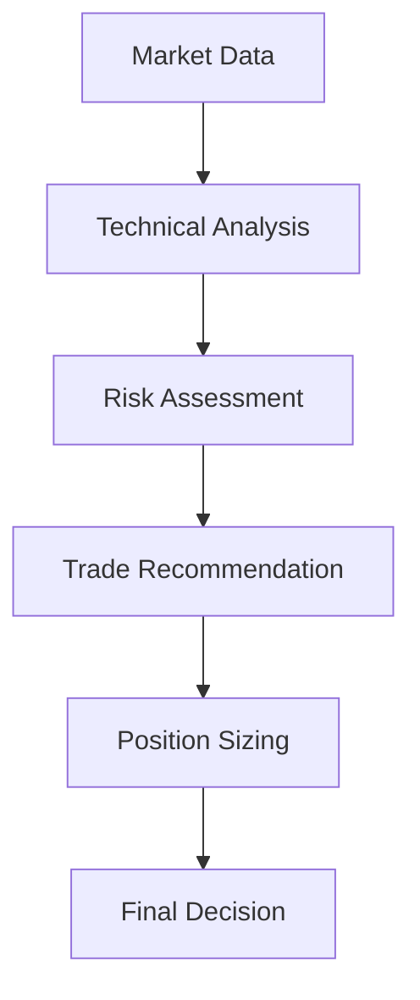

# Zerodha Kite MCP Server

<div align="center">


*A professional Model Context Protocol (MCP) server for Zerodha Kite Connect API*

[Features](#features) • [Quick Start](#quick-start) • [Documentation](#documentation) • [Examples](#examples) • [Contributing](#contributing)

</div>

## 📋 Table of Contents

- [Overview](#overview)
- [Features](#features)
- [Prerequisites](#prerequisites)
- [Installation](#installation)
- [Quick Start](#quick-start)
- [MCP Tools](#mcp-tools)
- [Usage Examples](#usage-examples)
- [Sequential Thinking](#sequential-thinking)
- [Configuration](#configuration)
- [Security](#security)
- [API Reference](#api-reference)
- [Troubleshooting](#troubleshooting)
- [Contributing](#contributing)
- [License](#license)
- [Support](#support)

## 🚀 Overview

The Zerodha Kite MCP Server provides a robust interface between AI assistants and the Indian stock market through Zerodha's Kite Connect API. Built with the Model Context Protocol (MCP), it enables seamless integration of trading capabilities, market data analysis, and portfolio management into AI workflows.

### What is MCP?
The Model Context Protocol (MCP) is an open standard that enables AI assistants to securely access external data sources and tools. This server implements MCP to provide AI systems with comprehensive trading capabilities.

## ✨ Features

| Feature | Description | Status |
|---------|-------------|--------|
| 📈 **Real-time Market Data** | Live stock prices, quotes, and market depth | ✅ Ready |
| 🧠 **AI-Powered Analysis** | Sequential thinking with technical indicators | ✅ Ready |
| 📊 **F&O Trading** | Futures and Options data with Greeks | ✅ Ready |
| 💼 **Portfolio Management** | Positions, margins, and P&L tracking | ✅ Ready |
| 🛡️ **Risk Management** | Built-in safety controls and limits | ✅ Ready |
| 🔄 **Order Management** | Place, modify, and monitor orders | ✅ Ready |
| 📱 **MCP Compatible** | Works with Claude, GPT, and other AI assistants | ✅ Ready |
| 🔒 **Secure** | Environment-based credential management | ✅ Ready |

## 📋 Prerequisites

- **Python 3.8+** (Recommended: Python 3.10+)
- **Zerodha Account** with Kite Connect access
- **API Credentials** from Zerodha Kite Connect
- **MCP-Compatible Client** (Claude Desktop, etc.)

## 📦 Installation

### Option 1: Quick Install (Recommended)

```bash
# Clone the repository
git clone https://github.com/yourusername/zerodha-kite-mcp-server.git
cd zerodha-kite-mcp-server

# Run the installation script
chmod +x install.sh
./install.sh
```

### Option 2: Manual Setup

```bash
# Create virtual environment
python3 -m venv zerodha_mcp_env
source zerodha_mcp_env/bin/activate

# Install dependencies
pip install -r requirements.txt

# Setup configuration
cp config.env.example config.env
```

## 🏁 Quick Start

### 1. Configure API Credentials

Edit `config.env` with your Zerodha Kite Connect credentials:

```bash
# Get these from: https://kite.trade/connect/login
KITE_API_KEY=your_api_key_here
KITE_API_SECRET=your_api_secret_here
```

### 2. Generate Access Token

```bash
python3 generate_access_token.py
```

### 3. Start the MCP Server

```bash
python3 zerodha_mcp_server.py
```

### 4. Configure Your AI Client

Add to your MCP client configuration (e.g., Claude Desktop):

```json
{
  "mcpServers": {
    "zerodha-kite": {
      "command": "python3",
      "args": ["/path/to/zerodha-kite-mcp-server/zerodha_mcp_server.py"],
      "env": {
        "PATH": "/path/to/zerodha-kite-mcp-server/zerodha_mcp_env/bin"
      }
    }
  }
}
```

## 🛠️ MCP Tools

The server provides 12 comprehensive tools for trading and analysis:

### 📊 Market Data Tools

| Tool | Purpose | Parameters |
|------|---------|------------|
| `get_market_data` | Real-time & historical data | symbol, exchange, interval, days |
| `get_fno_data` | Futures & Options data | symbol, instrument_type, expiry |
| `get_options_chain` | Complete options chain | symbol, expiry |
| `calculate_technical_indicators` | Technical analysis | symbol, days, interval |

### 💼 Trading Tools

| Tool | Purpose | Parameters |
|------|---------|------------|
| `place_order` | Buy/Sell orders | symbol, transaction_type, quantity, order_type |
| `monitor_orders` | Order status tracking | order_id (optional) |
| `set_stop_loss` | Risk management | symbol, stop_loss_price, target_price |
| `monitor_stop_orders` | Stop order tracking | symbol (optional) |

### 📈 Portfolio Tools

| Tool | Purpose | Parameters |
|------|---------|------------|
| `get_positions` | Current positions | position_type |
| `get_margins` | Account margins | segment |
| `get_risk_status` | Risk management status | include_history |

## 💡 Usage Examples

### Basic Market Analysis

```python
# Get NIFTY 50 data
get_market_data(symbol="NIFTY 50", exchange="NSE", days=30)

# Calculate technical indicators
calculate_technical_indicators(symbol="NIFTY 50", days=20)

# Get F&O data for options under ₹4000
get_fno_data(symbol="NIFTY", instrument_type="CE")
```

### Trading Operations

```python
# Place a buy order
place_order(
    tradingsymbol="RELIANCE", 
    transaction_type="BUY", 
    quantity=10, 
    order_type="MARKET"
)

# Set stop loss
set_stop_loss(
    tradingsymbol="RELIANCE", 
    stop_loss_price=2400, 
    target_price=2600
)

# Monitor positions
get_positions(position_type="day")
```

### Advanced Analysis

```python
# Get complete options chain
get_options_chain(symbol="BANKNIFTY", expiry="2025-09-25")

# Check risk status
get_risk_status(include_history=True)

# Monitor all orders
monitor_orders()
```

## 🧠 Sequential Thinking

The server implements AI-powered sequential thinking for market analysis:



### Analysis Process

1. **Data Collection**: Real-time prices, volume, technical indicators
2. **Pattern Recognition**: Trend analysis, support/resistance levels
3. **Risk Evaluation**: Volatility, market conditions, position sizing
4. **Decision Making**: BUY/SELL/HOLD with confidence levels
5. **Execution Planning**: Entry/exit points, stop-loss levels

## ⚙️ Configuration

### Environment Variables

| Variable | Description | Required | Default |
|----------|-------------|----------|---------|
| `KITE_API_KEY` | Your Kite Connect API key | ✅ | - |
| `KITE_API_SECRET` | Your Kite Connect API secret | ✅ | - |
| `KITE_ACCESS_TOKEN` | Generated access token | ✅ | Auto-generated |
| `MAX_DAILY_LOSS` | Maximum daily loss limit | ❌ | 10000 |
| `MAX_ORDER_VALUE` | Maximum single order value | ❌ | 50000 |
| `ENVIRONMENT` | Trading environment | ❌ | SANDBOX |

### Risk Management Settings

```bash
# Risk limits
MAX_DAILY_LOSS=10000
MAX_ORDER_VALUE=50000
MAX_ORDERS_PER_MINUTE=10

# Trading defaults
DEFAULT_PRODUCT=MIS
DEFAULT_ORDER_TYPE=MARKET
DEFAULT_EXCHANGE=NSE
```

## 🔒 Security

### Best Practices

- ✅ **Environment Variables**: All credentials stored in `config.env`
- ✅ **Git Ignore**: Sensitive files excluded from version control
- ✅ **Token Expiry**: Daily access token regeneration
- ✅ **Risk Limits**: Built-in trading safeguards
- ✅ **Sandbox Mode**: Test environment for development

### Credential Management

```bash
# ✅ DO: Use environment file
echo "KITE_API_KEY=your_key" >> config.env

# ❌ DON'T: Hardcode in scripts
api_key = "your_key_here"  # NEVER DO THIS
```

## 📚 API Reference

### Complete Tool Documentation

<details>
<summary><strong>get_market_data</strong></summary>

Fetch real-time and historical market data for any instrument.

**Parameters:**
- `symbol` (string): Trading symbol (e.g., "RELIANCE", "NIFTY 50")
- `exchange` (string): Exchange name (NSE, BSE) 
- `interval` (string): Time interval (minute, day, 3minute, etc.)
- `days` (integer): Number of days of historical data

**Returns:**
- Current price and change
- OHLC data
- Volume information
- Market depth

</details>

<details>
<summary><strong>place_order</strong></summary>

Place buy or sell orders with comprehensive parameters.

**Parameters:**
- `tradingsymbol` (string): Instrument to trade
- `transaction_type` (string): "BUY" or "SELL"
- `quantity` (integer): Number of shares/lots
- `order_type` (string): "MARKET", "LIMIT", "SL", "SL-M"
- `price` (float): Limit price (for LIMIT orders)
- `product` (string): "MIS", "CNC", "NRML"

**Returns:**
- Order ID
- Status confirmation
- Execution details

</details>

### Error Handling

The server implements comprehensive error handling:

```python
# API errors
{
    "error": "Invalid API credentials",
    "code": "AUTH_ERROR",
    "details": "Check your API key and secret"
}

# Trading errors
{
    "error": "Insufficient margin",
    "code": "MARGIN_ERROR", 
    "available": 5000,
    "required": 10000
}
```

## 🐛 Troubleshooting

### Common Issues

| Issue | Solution |
|-------|----------|
| **Import Error: No module 'mcp'** | Run: `pip install -r requirements.txt` |
| **Authentication Failed** | Check API credentials in `config.env` |
| **Access Token Expired** | Run: `python3 generate_access_token.py` |
| **Connection Timeout** | Verify internet connection and API status |
| **Order Rejected** | Check margins and market hours |

### Debug Mode

Enable detailed logging:

```bash
# Set environment variable
export LOG_LEVEL=DEBUG

# Run with verbose output
python3 zerodha_mcp_server.py --debug
```

### Health Check

Verify your setup:

```bash
# Run setup diagnostics
python3 setup.py

# Test basic connectivity
python3 -c "from zerodha_mcp_wrapper import *; print('✅ All imports successful')"
```

## 🤝 Contributing

We welcome contributions! Please see our [Contributing Guide](CONTRIBUTING.md) for details.

### Development Setup

```bash
# Fork and clone the repository
git clone https://github.com/yourusername/zerodha-kite-mcp-server.git

# Create development environment
python3 -m venv dev_env
source dev_env/bin/activate

# Install development dependencies
pip install -r requirements-dev.txt

# Run tests
pytest tests/
```

### Code Standards

- **Black** for code formatting
- **Flake8** for linting  
- **Type hints** for better code documentation
- **Docstrings** for all public functions

## 📄 License

This project is licensed under the MIT License - see the [LICENSE](LICENSE) file for details.

## 🆘 Support

### Get Help

- 📖 **Documentation**: Check our comprehensive guides
- 💬 **Issues**: [GitHub Issues](https://github.com/yourusername/zerodha-kite-mcp-server/issues)
- 📧 **Email**: support@example.com
- 💬 **Discord**: [Join our community](https://discord.gg/example)

### Zerodha Resources

- 📚 [Kite Connect Documentation](https://kite.trade/docs/connect/)
- 🔧 [API Console](https://kite.trade/connect/login)
- 📞 [Zerodha Support](https://support.zerodha.com/)

## 🏆 Acknowledgments

- **Zerodha** for providing the excellent Kite Connect API
- **Anthropic** for the Model Context Protocol specification
- **Open Source Community** for various Python libraries used

---

<div align="center">

**Built with ❤️ for algorithmic trading and market analysis**

[⭐ Star this repository](https://github.com/yourusername/zerodha-kite-mcp-server) if it helped you!

</div>